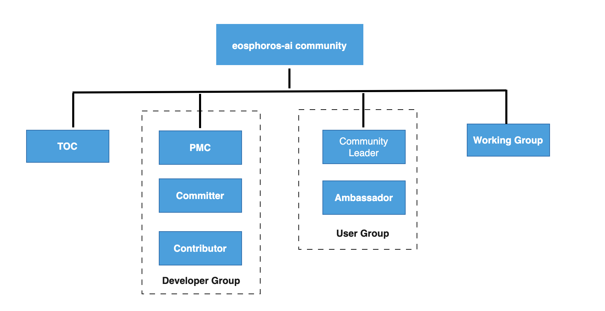

# eosphoros-ai community

Welcome to the eosphoros-ai community.

This is the starting point for becoming a contributor - improving code and docs, giving talks, etc.

# Contents
- [introduction](#introduction)
- [DB-GPT authors](#db-gpt-authors)
- [Community meeting](#community-meeting)
- [Contribute](#contribute)

# Other documents

  

- [Community Roles](./ROLES.md) - describes the roles individuals can assume within the DB-GPT community.
- [Working Groups](./WORKING-GROUPS.md) to enhance community transparency and collaboration among community members, DB-GPT created a series of working groups.

## Introduction
eosphoros-ai is a community which aim is Revolutionizing Database Interactions with Private LLM Technology, And DB-GPT is a private framework for Database and Larga Language Model.

Visit [dbgpt.io](http://dbgpt.io) for more information about using DB-GPT.

## DB-GPT authors
DB-GPT is an open source project started by AntGroup with an active development community. 

## Community meeting
- Saturday 8:00 PM CST(Beijing) every other week
- TODO: Metting Notes 

## Contribute
**Please note that the following rules are not mandatory.**

### Rule about Code quality

All of these rules
- CI passed
- at least one committer approve(will be two in the future)
 